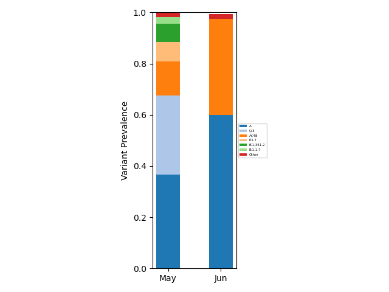
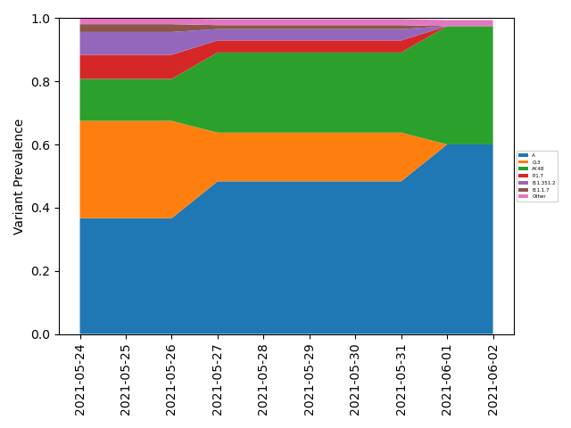

# Freyja
[](https://github.com/andersen-lab/Freyja/actions/workflows/python-package-conda.yml) [](https://anaconda.org/bioconda/freyja) [](https://anaconda.org/bioconda/freyja)

Freyja is a tool to recover relative lineage abundances from mixed SARS-CoV-2 samples from a sequencing dataset (BAM aligned to the Hu-1 reference). The method uses  lineage-determining mutational "barcodes" derived from the UShER global phylogenetic tree as a basis set to solve the constrained (unit sum, non-negative) de-mixing problem. 

Freyja is intended as a post-processing step after primer trimming and variant calling in [iVar (Grubaugh and Gangavaparu et al., 2019)](https://github.com/andersen-lab/ivar). From measurements of SNV freqency and sequencing depth at each position in the genome, Freyja returns an estimate of the true lineage abundances in the sample.   

## Installation via conda
Freyja is entirely written in Python 3, but requires preprocessing by tools like iVar and [samtools](https://github.com/samtools/samtools) mpileup to generate the required input data. We recommend using python3.7, but Freyja has been tested on python versions up to 3.10.  First, create an environment for freyja
```
conda create -n freyja-env
```
then add the following channels
```
conda config --add channels defaults
conda config --add channels bioconda
conda config --add channels conda-forge
```
and then install freyja
```
conda install freyja
```
### Dependencies
* [iVar](https://github.com/andersen-lab/ivar)
* [samtools](https://github.com/samtools/samtools)
* [UShER](https://usher-wiki.readthedocs.io/en/latest/#)
* [cvxpy](https://www.cvxpy.org/)
* [numpy](https://numpy.org/)
* [pandas](https://pandas.pydata.org/)

## Usage
After primer trimming in iVar, we get both variant call and sequencing depth information with the command:
```
freyja variants [bamfile] --variants [variant outfile name] --depths [depths outfile name] --ref [reference.fa]
```
which uses both samtools and iVar. Note that the reference should match the fasta file used for alignment. In cases where multiple reference genomes are present in the reference fasta, the user can specify the name of the desired reference genome with `--refname [name-of-reference]`. To enable alternative variant calling methods ( such as [LoFreq](https://csb5.github.io/lofreq/)),  we also allow users to provide a VCF file using the `--variants` option (in addition to the usual depth file, which can be obtained using a command like ```samtools mpileup -aa -A -d 600000 -Q 20 -q 0 -B -f ref.fasta sample.bam | cut -f1-4 > sample.depth```).

We can then run Freyja on the output files using the commmand:
```
freyja demix [variants-file] [depth-file] --output [output-file]
```
This outputs to a tsv file that includes the lineages present, their corresponding abundances, and summarization by constellation. This method also includes a `--eps` option, which enables the user to define the minimum lineage abundance returned to the user (e.g. `--eps 0.0001`). A custom barcode file can be provided using the `--barcodes [path-to-barcode-file]` option. As the UShER tree now included proposed lineages, we now offer the ```--confirmedonly``` flag which removes unconfirmed lineages from the analysis. For additional flexibility and reproducibility of analyses, a custom lineage-to-contellation mapping metadata file can be provided using the `--meta` option. An example output should have the format


|       | filename |
| ----------- | ----------- |
| summarized      | [('Delta', 0.65),  ('Other', 0.25),  ('Alpha', 0.1')] |
| lineages   | ['B.1.617.2' 'B.1.2' 'AY.6' 'Q.3']       |
| abundances   | "[0.5 0.25 0.15 0.1]"|
| resid   | 3.14159        |
| coverage   | 95.8        |

Where ```summarized``` denotes a sum of all lineage abundances in a particular WHO designation (i.e. B.1.617.2 and AY.6 abundances are summed in the above example), otherwise they are grouped into "Other". The ```lineage``` array lists the identified lineages in descending order, and  ```abundances``` contains the corresponding abundances estimates. The value of ```resid``` corresponds to the residual of the weighted least absolute devation problem used to estimate lineage abundances. The ```coverage``` value provides the 10x coverage estimate (percent of sites with 10 or greater reads- 10 is the default but can be modfied using the ```--covcut``` option in ```demix```). 

NOTE: The ```freyja variants``` output is stable in time, and does not need to be re-run to incorporate updated lineage designations/corresponding mutational barcodes, whereas the outputs of ```freyja demix``` will change as barcodes are updated (and thus ```demix``` should be re-run as new information is made available).

---
### Additional options
By default, this method ships with an existing "data/usher_barcodes.csv" file for the barcodes, and the [outbreak.info](https://outbreak.info/) curated lineage metadata file for summarizing lineages by WHO designation. To update both of these we recommend running the command

```
freyja update
```
which downloads new versions of the curated lineage file as well as the UShER global phylogenetic [tree](http://hgdownload.soe.ucsc.edu/goldenPath/wuhCor1/UShER_SARS-CoV-2/), which is subsequently converted into barcodes and saved in "data/usher_barcodes.csv". The ```--outdir``` option can be used to specify a local directory to store the lineage mapping and barcode files. By default, Freyja now only includes lineages that are present on [cov-lineages.org](https://cov-lineages.org/). To include proposed lineages and lineages that haven't been released via cov-lineages (usually this lag is no more than a few days), the ``` --noncl``` flag can be used.  

We now provide a fast bootstrapping method for freyja, which can be run using the command

```
freyja boot [variants-file] [depth-file] --nt [number-of-cpus] --nb [number-of-bootstraps] --output_basename [base-name]
```
which results in two output files `base-name_lineages.csv` and `base-name_summarized.csv`, which contain the 0.025, 0.05,0.25,0.5 (median),0.75, 0.95, and 0.975 percentiles for each lineage and WHO designated VOI/VOC, respectively, as obtained via the bootstrap. We also provide the `--eps`, `--barcodes`, and `--meta` options as in `freyja demix`. We now also provide a `--boxplot` option, which should be specified in the form `--boxplot pdf` if you want the boxplot in pdf format. 

For rapid visualization of results, we also offer two utility methods for manipulating the "demixed" output files. The first is an aggregation method

```
freyja aggregate [directory-of-output-files] --output [aggregated-filename.tsv]
```
By default, the minimum genome coverage is set at 60 percent. To adjust this, the ```--mincov``` option can be used (e.g. ```--mincov 75```.We also now allow the user to specify a file extension of their choosing, using the ```--ext``` option (for example, for ```demix``` outputs called ```X.output```)

```
freyja aggregate [directory-of-output-files] --output [aggregated-filename.tsv] --ext output
```
This resulting aggregated data can analyzed directly as a tsv file, or can be visualized using

```
freyja plot [aggregated-filename-tsv] --output [plot-filename(.pdf,.png,etc.)]
```
which provides a fractional abundance estimate for all aggregated samples. To modify the provide a lineage specific breakdown, the `--lineages` flag can be used. We now provide a `--colors [path-to-csv-of-hex-codes]` option so users can control the colors of the plot (see `freyja/data/colors.csv` for an [example input file](https://github.com/andersen-lab/Freyja/blob/main/freyja/data/colors.csv).   Example outputs:

|**Summarized** | **Lineage-Specific**|
|     :---:      |     :---:      |
| | |

If users wish to include sample collection time information, this can be done using 

```
freyja plot [aggregated-filename-tsv] --output [plot-filename(.pdf,.png,etc.)] --times [times_metadata.csv(note csv!)] --interval [MS or D (month/day bins)]
```

When using the `--interval D` option, the `--windowsize NN` should also be specified, where `NN` is the width of the rolling average window. See `freyja/data/times_metadata.csv` for an example collection time metadata file. Example outputs:

|**Month binning** | **Daily binning (with smoothing)**|
|     :---:      |     :---:      |
| | |


We are now providing functionality to rapidly prepare a dashboard web page, directly from aggregated freyja output. This can be done with the command

```
freyja dash [aggregated-filename-tsv] [sample-metadata.csv] [dashboard-title.txt] [introContent.txt] --output [outputname.html]
```
where the metadata file should have this [form](freyja/data/sweep_metadata.csv). See example [title](freyja/data/title.txt) and [intro-text](freyja/data/introContent.txt) files as well. For samples taken the same day, we average the freyja outputs by default. However, averaging can be performed that takes the viral loads into account using the ```--scale_by_viral_load``` flag. The header and body color can be changed with the ```--headerColor [mycolorname/hexcolor]``` and ```--bodyColor [mycolorname/hexcolor]``` option respectively. The ```--mincov``` option is also available, as in ```plot```. The resulting dashboard will look like [this](https://htmlpreview.github.io/?https://github.com/andersen-lab/Freyja/blob/main/freyja/data/test0.html).

The plot can now be configured using the ```--config [path-to-plot-config-file]``` option. The [plot config file](freyja/data/plot_config.yml) is a yaml file. More information about the plot config file can be found in the [sample config file](freyja/data/plot_config.yml). 

A CSV file will also be created along with the html dashboard which will contain the relative growth rates for each lineage. The lineages will be grouped together based on the `Lineages` key specified in the config file if provided.

```
freyja relgrowthrate [aggregated-filename-tsv] [sample-metadata.csv] --output [outputname.html] --config [path-to-plot-config-file]
```

The above command will generate the relative growth rates for each Lineage and output it as a CSV file. The lineages can also be grouped together by passing the `--config [path-to-plot-config-file]` option. This uses the same configuration file as the `dash` command. THe lineages are grouped together based on the `Lineage:` field in the config file. The number of bootstraps can be specified with the `--nboots [number-of-bootstraps]` option and the serial interval can be specified with the `--serial_interval` option. The output will be a CSV file with the following columns:
- Lineage
- Estimated Advantage
- Bootstrap 95% interval
