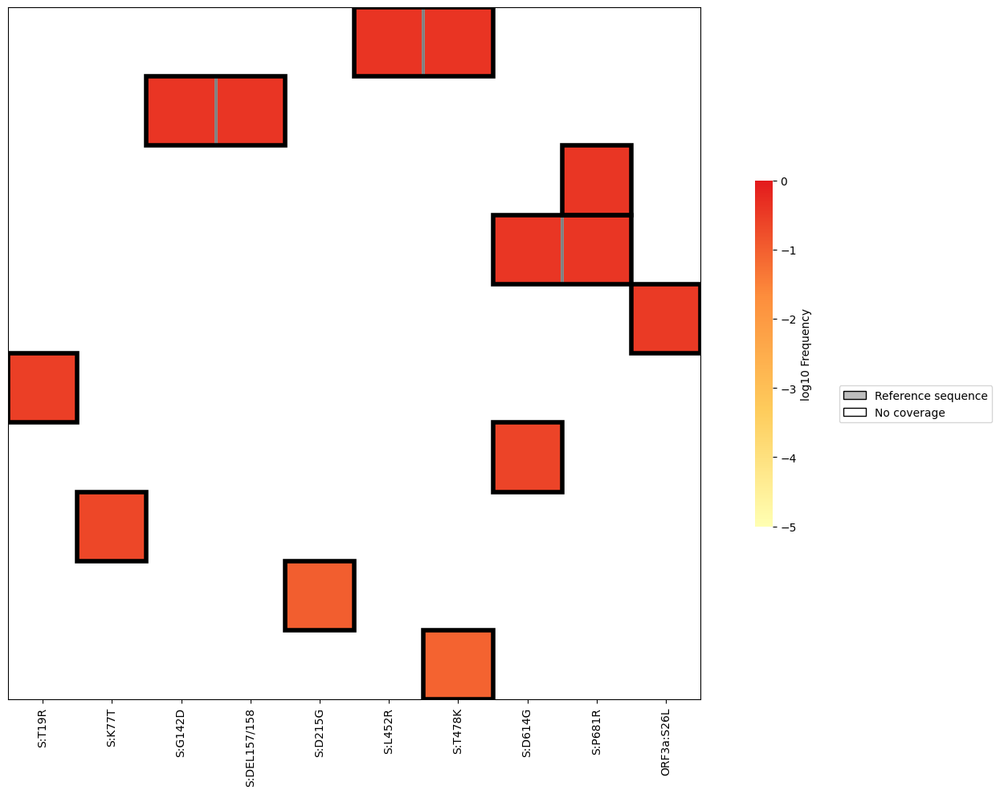
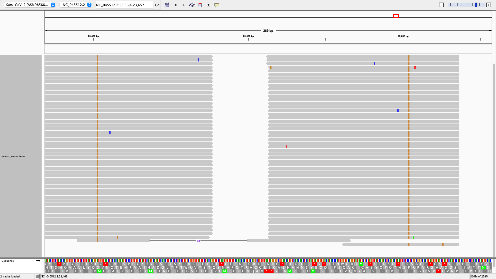

Read Analysis Tutorial
-------------------------------------------------------------------------------

For this tutorial, we’ll begin with the same aligned, trimmed, and
sorted BAM file,
`test.bam <https://github.com/andersen-lab/Freyja/raw/main/freyja/data/test.bam>`__
used in the Command Line Workflow tutorial, along with the corresponding
`SARS-Cov-2 reference genome <data/NC_045512_Hu-1.fasta>`__.

Let’s start off by finding covariant mutations (i.e. mutations present
on the same sequenced read) on the spike gene. We can do so using the
command:

.. code:: bash

   freyja covariants freyja/data/test.bam 21563 25384 --output covariants_output.tsv --gff-file freyja/data/NC_045512_Hu-1.gff

This saves covariance information to covariants_output.tsv, including
the mutations present, their absolute count and frequency, as well as
the genomic ranges covered by reads containing said mutations. To get a
better sense of the data, we can generate a heatmap plot via:

.. code:: bash

   freyja plot-covariants covariants_output.tsv --output covariants_heatmap.png 

As we can see, there appear to be a number of mutations that occur
together in this sample, such as S:D614G and S:P681R. We can pull these
reads from test.bam using ``freyja extract``. First, we must specify the
mutations by creating a csv file, and then listing the corresponding
nucleotide mutations, which are listed in covariants_output.tsv.:

::

   A23403G,C23604G

We can now run ``freyja extract``, passing in our query.csv file
alongside test.bam. We’ll include the –same_read flag since we’re only
interested in reads where both mutations are present

.. code:: bash

   freyja extract query.csv freyja/data/test.bam --same_read --output extracted.bam

Finally, we can view the pulled reads via IGV. First, we’ll need to sort
and index ``extracted.bam``:

.. code:: bash

   samtools sort extracted.bam > extracted_sorted.bam
   samtools index extracted_sorted.bam

Now load extracted_sorted.bam into IGV! |igv image|

In some cases, it can be useful to remove reads containing one or more
mutations. For instance, we might be interested in reads containing
S:D614G but **not** S:P681R. We can do this by first calling
``freyja extract`` to select reads containing S:D614G, and then using
``freyja filter`` on the extraced output to filter out reads containing
S:P681R.

1. Extract S:D614G reads:

::

   extract_query.csv: 
   A23403G

.. code:: bash

   freyja extract extract_query.csv freyja/data/test.bam --output S_D614G_extracted.bam
   samtools sort S_D614G_extracted.bam > S_D614G_extracted_sorted.bam
   samtools index S_D614G_extracted_sorted.bam

2. Filter S:P681R reads from ``S_D614G_extracted.bam``

::

   filter_query.csv:
   C23604G

.. code:: bash

   freyja filter filter_query.csv freyja/data/test.bam --output S_D614G_filtered.bam

The resulting S_D614G_filtered.bam should only contain reads containing
S:D614G (which in this case happen to be unpaired reads with no coverage
at S:P681).

