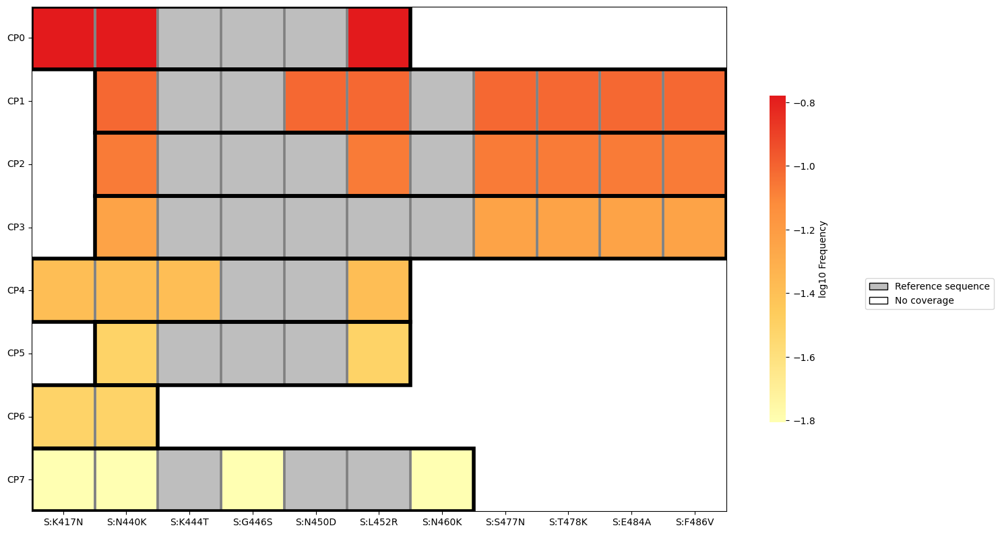

.. click:: freyja._cli:plot_covariants
    :prog: freyja plot-covariants
    :nested: full
    :commands: plot-covariants
------------

**Example Usage:**

This generates an informative heatmap visualization showing the
frequency and coverage ranges of each observed covariant pattern. ``--num_clusters`` sets the
number of patterns (i.e. rows in the plot) to display, while the
threshold ``--min_mutations`` sets a minimum number of mutations per set
of covariants for inclusion in the plot. The flag ``--nt_muts`` can be
included to provide nucleotide-specific information in the plot
(e.g. C22995A(S:T478K) as opposed to S:T478K), making it possible to
view multi-nucleotide variants.

**Example output:**

|image2|

