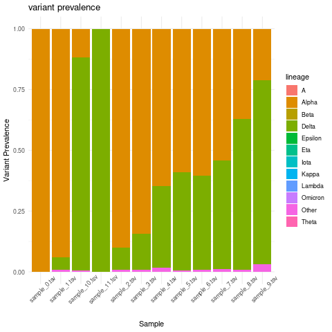
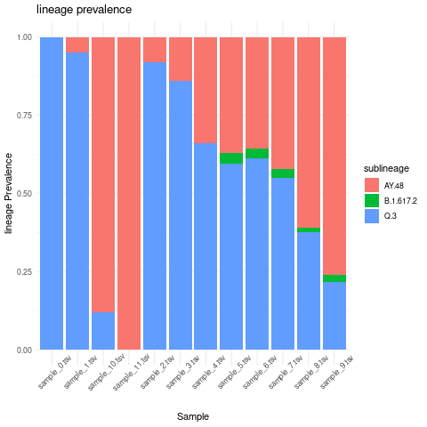
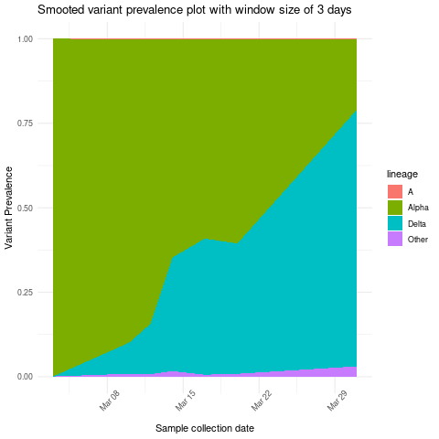

Demix output manipulation and plotting using R
-------------------------------------------------------------------------------

Here we discuss freyja ``demix`` output manipulation and plotting using R programming
language.

1. Change freyja ``demix`` output to a dataframe format.

.. code:: R

    library(data.table)
    library(tidyverse)
    library(lubridate)
    library(runner)
    # Code credit for parsing the demix output: https://github.com/a-roguet

    results<-read.table("test_sweep.tsv", fill = TRUE, sep = "\t", h=T)
    results<-as.data.frame(sapply(results, function(x) str_replace_all(x, "[',()\\]\\[]", ""))) # Removed the unwanted character: [], () and commas
    results<-as.data.frame(sapply(results, function(x) trimws(gsub("\\s+", " ", x)))) # Removed double spaces

    # Summarized data
    summarized<-as.data.frame(setDT(tstrsplit(as.character(results$summarized), " ", fixed=TRUE))[]) # Extract Summarized data
    summarized$sample<-results$X

    for(i in 1:((ncol(summarized)-1)/2)){
      if(i==1){
        summarized.final<-summarized[,c(ncol(summarized),1:2)]
      } else {
        start=i*2-1; end=i*2
        summarized.final<-rbind(summarized.final, setNames(summarized[,c(ncol(summarized), start:end)], names(summarized.final)))
      }
    }
    summarized.final<-summarized.final[complete.cases(summarized.final), ]
    names(summarized.final)<-c("Sample", "lineage", "abundance")

    # Sublineages data
    for(i in 1:nrow(results)){
      lineages.temp<-as.data.frame(t(setDT(tstrsplit(as.character(results[i, 3]), " ", fixed=TRUE))[]))
      abundances.temp<-as.data.frame(t(setDT(tstrsplit(as.character(results[i, 4]), " ", fixed=TRUE))[]))
      sample.temp<-rep(results[i, 1], nrow(lineages.temp))
      if(i==1){
        sublineages.final<-cbind(sample.temp, lineages.temp, abundances.temp)
      } else {
        sublineages.final<-rbind(sublineages.final, cbind(sample.temp, lineages.temp, abundances.temp))
      }
    }
    names(sublineages.final)<-c("Sample", "sublineage", "abundance")

2. Read in time metadata information and merge it with abundance dataframe

.. code:: R

    time_metadata <- fread("sweep_metadata.csv")
    combined_lineage_abundance_time_data <- time_metadata %>%
      inner_join(summarized.final, by = "Sample")
    combined_sublineage_abundance_time_data <- time_metadata %>%
      inner_join(sublineages.final, by = "Sample")

- Optional: you can also add custom lineage grouping as following:

.. code:: R

    # get rows with sub-lineage value starting with "AY"
    sublin_grouping <- combined_sublineage_abundance_time_data %>%
      filter(str_detect(sublineage, "^AY"))
    # Add a grouping column
    sublin_grouping$grouping <- "AY.X"
    # get rows with sub-lineage value not starting with "AY"
    other_sublineages <-combined_sublineage_abundance_time_data %>%
      filter(!str_detect(sublineage, "^AY"))
    # Add a grouping column
    other_sublineages$grouping <-"other"
    # Merge the two dataframes
    grouped_sublineage_data <- rbind(sublin_grouping,other_sublineages)
3. Create Variant prevalence stacked bar plots grouped by month intervals

.. code:: R

     combined_lineage_abundance_time_data %>%
      mutate(month = as.factor(month(mdy(sample_collection_datetime),abbr=TRUE,label = TRUE)))%>%
      mutate(abundance = as.numeric(abundance))%>%
      group_by(lineage,month)%>%
      summarise(mean_monthly_abundance = mean(abundance)) %>%
       ggplot(grouped_interval_lineage,
              mapping = aes(fill= lineage, y=mean_monthly_abundance, x=month)) +
       geom_bar(position="fill", stat="identity") +
       theme_minimal() +ylab("Variant Prevalence") +
       ggtitle("Variant prevalence per month")

.. |month_var_prev| image:: images/variant_prevalence_monthly.png

|month_var_prev|

4. Create lineage prevalence stacked bar plots grouped by month interval

.. code:: R

      combined_sublineage_abundance_time_data %>%
      mutate(month = as.factor(month(mdy(sample_collection_datetime),abbr=TRUE,label = TRUE)))%>%
      mutate(month = as.factor(month)) %>%
      mutate(abundance = as.numeric(abundance))%>%
        filter(abundance >0.01)%>%
      group_by(sublineage,month)%>%
      summarise(mean_monthly_abundance = mean(abundance))%>%
      ggplot(grouped_interval_sublineage,
             mapping = aes(fill=sublineage, y=mean_monthly_abundance, x=month)) +
      geom_bar(position="fill", stat="identity") +
        theme_minimal() +ylab("Variant Prevalence") +
      ggtitle("Lineage prevalence per month")

.. |month_lineage_prev| image:: images/lineage_prevalence_monthly.png

|month_lineage_prev|

5. Create variant prevalence per sample stacked bar plot

.. code:: R

    combined_lineage_abundance_time_data %>%
      mutate(abundance = as.numeric(abundance))%>%
      group_by(lineage, Sample)%>%
      summarise(mean_sample_abundance = mean(abundance)) %>%
      ggplot(grouped_interval_lineage,
             mapping = aes(fill= lineage, y=mean_sample_abundance, x=Sample)) +
      geom_bar(position="fill", stat="identity") +
      theme_minimal() +ylab("Variant Prevalence") +
      ggtitle("variant prevalence") + theme(axis.text.x = element_text(angle = 45))

|sample_var_prev|

6. Create lineage prevalence per sample stacked bar plot

.. code:: R

    combined_sublineage_abundance_time_data %>%
      mutate(abundance = as.numeric(abundance))%>%
      filter(abundance >0.01)%>%
      group_by(sublineage,Sample)%>%
      summarise(mean_sample_abundance = mean(abundance))%>%
      ggplot(grouped_interval_sublineage,
             mapping = aes(fill=sublineage, y=mean_sample_abundance, x=Sample)) +
      geom_bar(position="fill", stat="identity") +
      theme_minimal() +ylab("lineage Prevalence") +
      ggtitle("lineage prevalence")+ theme(axis.text.x = element_text(angle = 45))

|sample_lin_prev|

7. Create stacked area plot showing variant prevalence based on moving average of three days

.. code:: R

    combined_lineage_abundance_time_data %>%
      mutate(sample_collection_datetime = mdy(sample_collection_datetime)) %>%
      mutate(abundance = as.numeric(abundance))%>%
      group_by(lineage) %>% arrange(sample_collection_datetime) %>%
      mutate(mov_avg_abun = mean_run(abundance, k = 3, lag = 1, idx = as.Date(sample_collection_datetime))) %>%
      ggplot(aes(x=sample_collection_datetime,y=mov_avg_abun,group=lineage,fill=lineage)) +
      geom_area(position="fill")+ theme_minimal() +ylab("Variant Prevalence")+
      xlab("Sample collection date")+  ggtitle("Smooted variant prevalence plot with window size of 3 days") +
      theme(axis.text.x = element_text(angle = 45))

|stacked_area|