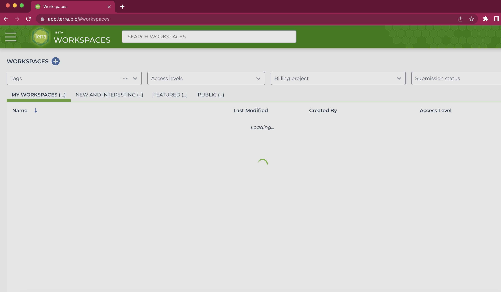
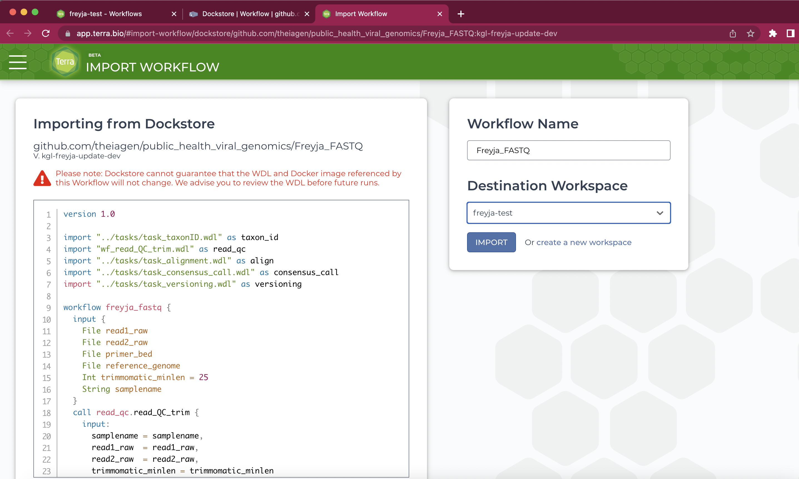
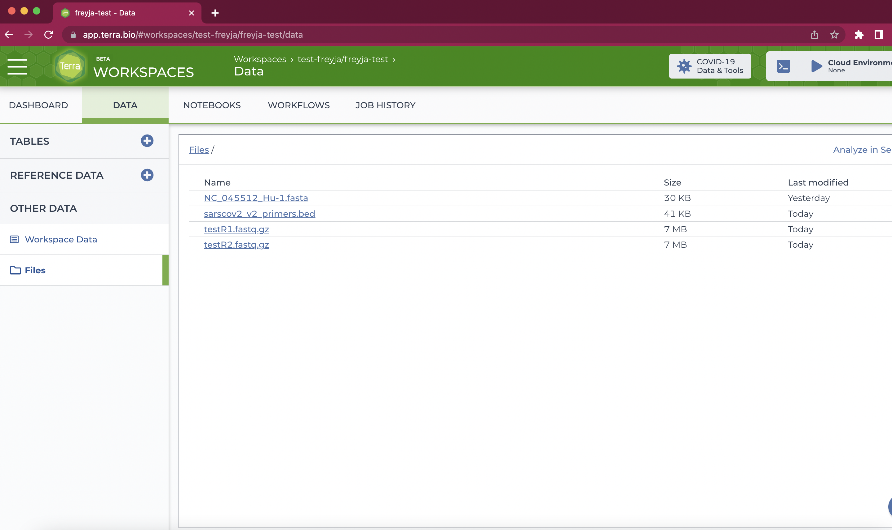
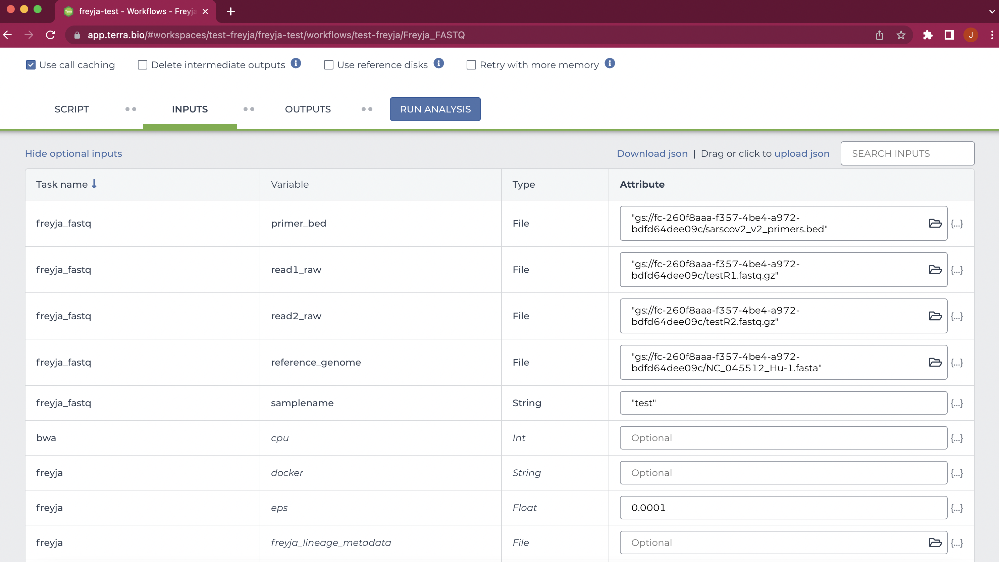
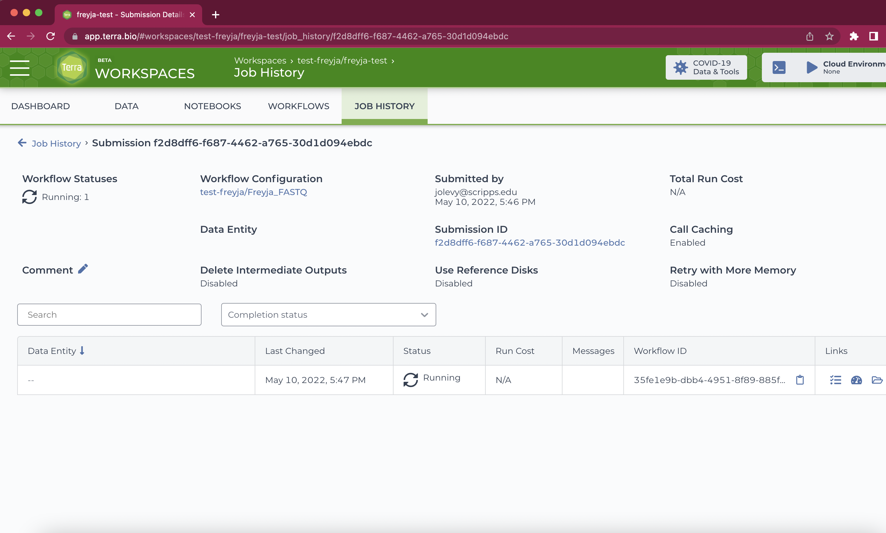
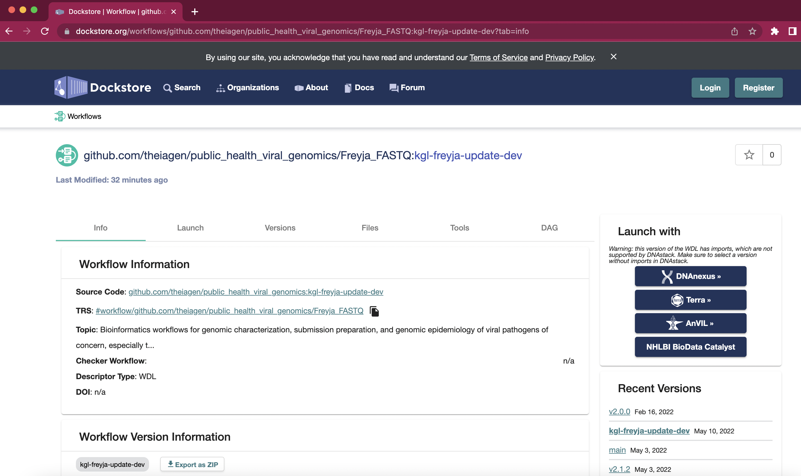
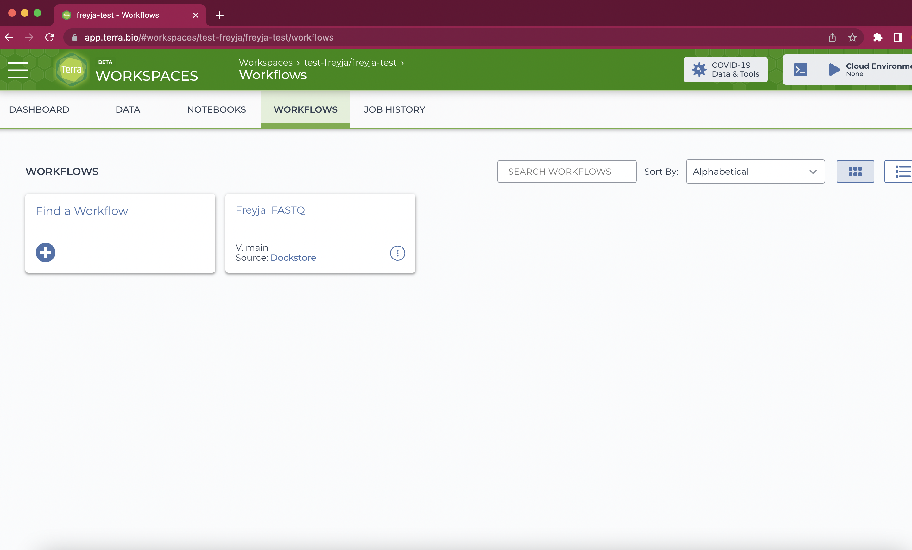

Terra Workflow
-------------------------------------------------------------------------------

To run Freyja using a web interface, we recommend using the Terra
ecosystem. If you haven’t used Terra before, it’s pretty easy to set
things up. You’ll need to: 1. Sign up for a Terra account at
https://app.terra.bio/ 2. Set up billing: All accounts get $300 in free
credit (see
`here <https://support.terra.bio/hc/en-us/articles/360046295092>`__),
which will allow you to run the pipeline on a ton of samples 3. Create a
`workspace <https://app.terra.bio/#workspaces>`__. - Click the “+” in
the top left, and give the workspace a name (anything will do)

4. Select the required methods from
   `dockstore <https://dockstore.org/search?entryType=workflows&search=freyja>`__.
   Clicking on the Terra button on the right hand side will take you to
   Terra and allow you to import the method into your workspace. |image|

-  `Freyja_FASTQ <https://dockstore.org/workflows/github.com/theiagen/public_health_viral_genomics/Freyja_FASTQ:main?tab=info>`__:
   takes you from raw data to de-mixed output in a single step (combines
   the ``freyja variants`` and ``freyja demix`` steps described in the
   README).
-  `Freyja_Plot <https://dockstore.org/workflows/github.com/theiagen/public_health_viral_genomics/Freyja_Plot:main?tab=info>`__:
   takes in output files from Freyja_FASTQ and renders plots of virus
   lineage fractions (using the ``freyja plot`` function described in
   the README)

Once you’ve loaded the methods into your workspace, you can go ahead and
run the workflow on your data. You’ll first want to run the Freyja_FASTQ
method on some raw data.

5. Add all of the data you need to your workspace. This is done by
   clicking the “Data” tab, and then the “Files” option on the left side
   of the page. Files can then be added by dragging files (one at a
   time) into the window or by clicking the “+” sign in the bottom
   right. If you’re not sure which files you need, proceed to steps 6-7
   to see the required input data.

Note: many files can be uploaded at once using the Terra `data
uploader <https://app.terra.bio/#upload>`__. For more details, check out
this
`protocol <https://www.protocols.io/view/uploading-data-files-to-terra-byxjpxkn.html>`__.

6. Inside of your new workspace, go to the workflows tab and select the
   workflow you want to run. |workflows|

7. Add all of the necessary files to be used in the workflow, add any
   options you want, save, and click “Run Analysis” to start the
   workflow. Note that the filename needs to be given in quotes as shown
   below:

8. Add any comments you need and click “Launch”. You’ll be brought to a
   progress window. All output files will appear in the execution
   directory (open folder icon, under “Links”).

9. Wait until the job completes and download output files from the
   execution directory as needed. For ``Freyja_FASTQ`` you’ll find the
   de-mixed results in the ``[mysamplename]_freyja_demixed.tsv`` file.
   Download files by clicking downward arrow symbol on the right.

.. figure:: images/downloadresult.png
   :alt: downloadresult

